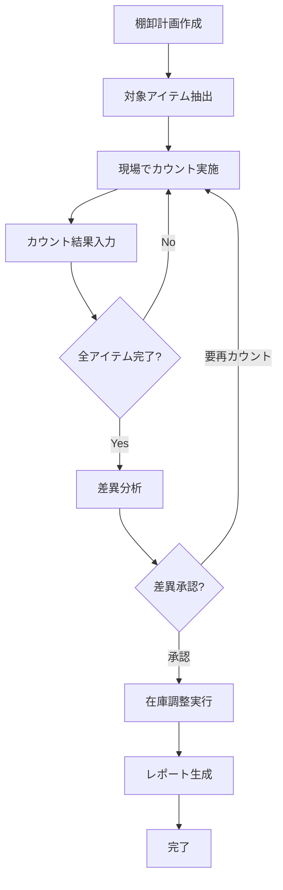
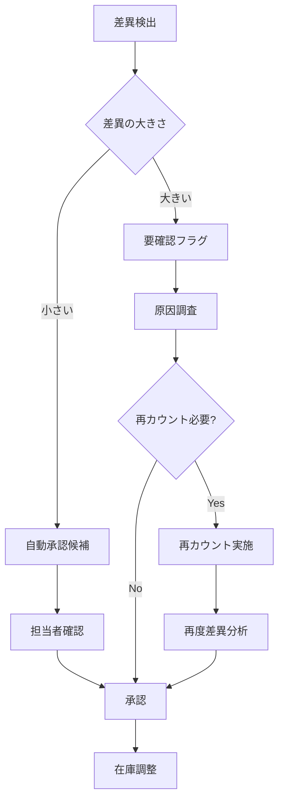

# 棚卸（在庫確認）機能設計書

**作成日**: 2025-11-17
**ステータス**: 設計フェーズ（未実装）
**優先度**: 将来実装予定

---

## 📋 目次

1. [概要](#概要)
2. [機能要件](#機能要件)
3. [画面設計](#画面設計)
4. [データベース設計](#データベース設計)
5. [ワークフロー](#ワークフロー)
6. [既存システムとの連携](#既存システムとの連携)
7. [技術実装アプローチ](#技術実装アプローチ)
8. [将来拡張性](#将来拡張性)

---

## 概要

### 棚卸とは

**棚卸（Inventory Check/Physical Inventory Count）** は、定期的に実施する物理的な在庫確認作業です。

#### 日常的な在庫管理との違い

| 項目 | 日常的な在庫管理 | 棚卸 |
|------|----------------|------|
| **頻度** | 日次・随時 | 月次・年次（定期） |
| **目的** | 日々の入出庫記録 | 帳簿在庫と実在庫の突合 |
| **対象** | 主に商品 | 全資産（商品+梱包資材+備品） |
| **方法** | システム入力 | 物理的カウント |
| **結果** | 在庫数更新 | 差異検出→調整→会計反映 |

### 独立メニューとする理由

1. **横断的スコープ**: 商品だけでなく、梱包資材・備品も対象
2. **異なるワークフロー**: カウント→照合→差異分析→調整という特殊な流れ
3. **会計・監査要件**: 定期的な実施記録と証跡保持が必要
4. **専用UI**: 物理カウント入力に最適化された画面が必要

---

## 機能要件

### 必須機能（MVP）

#### 1. 棚卸計画作成
- 棚卸実施日設定
- 対象資産カテゴリ選択（商品/梱包資材/備品）
- 担当者割り当て
- カウント方式選択（全数/ABC分析/循環棚卸）

#### 2. カウント入力画面
- **モバイル最適化**: スマートフォンで現場入力
- **バーコードスキャン対応**: 商品管理番号読み取り
- **手動入力**: 資材・備品など
- **写真添付**: 証跡保持
- **オフライン対応**: ネットワーク不安定でも入力可能

#### 3. 差異分析
- 帳簿在庫 vs 実在庫の比較表示
- 差異率・差異金額の自動計算
- 差異原因コード入力（紛失/破損/カウントミス等）
- 閾値アラート（差異が大きい場合に警告）

#### 4. 在庫調整
- 差異を承認して実在庫に反映
- 調整仕訳の自動生成（将来的に会計連携）
- 調整履歴の記録

#### 5. 棚卸レポート
- 実施結果サマリー
- 差異分析レポート
- 担当者別進捗状況
- 過去実施履歴との比較

### 将来拡張機能

- **ABC分析連動**: 重要度に応じたカウント頻度設定
- **循環棚卸**: 毎月異なるカテゴリを実施
- **AIによる差異原因推定**: 過去データから原因を予測
- **会計システム連携**: 棚卸資産計上の自動化

---

## 画面設計

### 3.1 棚卸一覧画面

```
┌─────────────────────────────────────┐
│ ← 棚卸管理           🔍 検索  ➕ 新規 │
├─────────────────────────────────────┤
│                                     │
│ 📅 実施予定（2件）                   │
│ ┌─────────────────────────────────┐ │
│ │ 2025年11月棚卸                   │ │
│ │ 実施日: 11/30  担当: 山田太郎     │ │
│ │ 進捗: ━━━━━━━━━━ 65%            │ │
│ │        [続きから開始]            │ │
│ └─────────────────────────────────┘ │
│                                     │
│ 📊 完了済（3件）                     │
│ ┌─────────────────────────────────┐ │
│ │ 2025年10月棚卸  ✅ 完了           │ │
│ │ 差異: ±2.3%  調整済              │ │
│ │        [レポート表示]            │ │
│ └─────────────────────────────────┘ │
│                                     │
└─────────────────────────────────────┘
```

### 3.2 棚卸計画作成画面

```
┌─────────────────────────────────────┐
│ ← 棚卸計画作成                       │
├─────────────────────────────────────┤
│                                     │
│ 📝 基本情報                          │
│ ┌─────────────────────────────────┐ │
│ │ 棚卸名称: [2025年11月棚卸]       │ │
│ │ 実施日:   [2025-11-30] 📅        │ │
│ │ 担当者:   [山田太郎 ▼]           │ │
│ └─────────────────────────────────┘ │
│                                     │
│ 📦 対象資産                          │
│ ┌─────────────────────────────────┐ │
│ │ ☑ 商品在庫（457点）              │ │
│ │ ☑ 梱包資材（23種類）             │ │
│ │ ☐ 備品（12種類）                 │ │
│ └─────────────────────────────────┘ │
│                                     │
│ 🎯 カウント方式                      │
│ ┌─────────────────────────────────┐ │
│ │ ○ 全数棚卸（全アイテム）         │ │
│ │ ○ ABC分析（重要度別）            │ │
│ │ ○ 循環棚卸（カテゴリ別）         │ │
│ └─────────────────────────────────┘ │
│                                     │
│         [キャンセル]  [作成開始]     │
│                                     │
└─────────────────────────────────────┘
```

### 3.3 カウント入力画面（モバイル最適化）

```
┌─────────────────────────────────────┐
│ ← 棚卸カウント入力    進捗: 65/100  │
├─────────────────────────────────────┤
│                                     │
│ 📷 [バーコードスキャン]              │
│                                     │
│ または手動入力:                      │
│ ┌─────────────────────────────────┐ │
│ │ 管理番号: [________] 🔍          │ │
│ └─────────────────────────────────┘ │
│                                     │
│ 📦 対象アイテム                      │
│ ┌─────────────────────────────────┐ │
│ │ ブランド: CHANEL                 │ │
│ │ カテゴリ: トップス/Tシャツ       │ │
│ │ サイズ: M  カラー: ブラック      │ │
│ │                                 │ │
│ │ 📊 帳簿在庫: 3点                 │ │
│ │ 📝 実在庫: [____] 点 入力        │ │
│ │                                 │ │
│ │ 💬 備考（任意）:                 │ │
│ │ [___________________________]   │ │
│ │                                 │ │
│ │ 📷 [写真を追加]                  │ │
│ └─────────────────────────────────┘ │
│                                     │
│       [スキップ]  [次へ（保存）]    │
│                                     │
└─────────────────────────────────────┘
```

### 3.4 差異分析画面

```
┌─────────────────────────────────────┐
│ ← 差異分析                           │
├─────────────────────────────────────┤
│                                     │
│ 📊 サマリー                          │
│ ┌─────────────────────────────────┐ │
│ │ カウント完了: 457点              │ │
│ │ 差異あり:     23点（5.0%）       │ │
│ │ 過不足金額:   -¥12,450          │ │
│ └─────────────────────────────────┘ │
│                                     │
│ ⚠️ 差異大（要確認: 5点）             │
│ ┌─────────────────────────────────┐ │
│ │ CHANEL Tシャツ M ブラック        │ │
│ │ 帳簿: 3点 → 実在庫: 1点 (-2)    │ │
│ │ 差異原因: [紛失 ▼]               │ │
│ │         [再カウント] [承認]      │ │
│ └─────────────────────────────────┘ │
│                                     │
│ ✅ 差異小（自動承認可: 18点）        │
│ ┌─────────────────────────────────┐ │
│ │ [一覧を表示]                     │ │
│ └─────────────────────────────────┘ │
│                                     │
│    [全て再カウント]  [差異を承認]   │
│                                     │
└─────────────────────────────────────┘
```

### 3.5 棚卸レポート画面

```
┌─────────────────────────────────────┐
│ ← 棚卸レポート        📥 PDF出力    │
├─────────────────────────────────────┤
│                                     │
│ 2025年11月棚卸 - 実施結果            │
│                                     │
│ 📅 実施情報                          │
│ ┌─────────────────────────────────┐ │
│ │ 実施日: 2025-11-30              │ │
│ │ 担当者: 山田太郎                 │ │
│ │ 対象: 商品457点+梱包資材23種     │ │
│ └─────────────────────────────────┘ │
│                                     │
│ 📊 差異サマリー                      │
│ ┌─────────────────────────────────┐ │
│ │ 差異率:     5.0%                │ │
│ │ 差異金額:   -¥12,450            │ │
│ │ 調整点数:   23点                │ │
│ └─────────────────────────────────┘ │
│                                     │
│ 🔍 差異原因分析                      │
│ ┌─────────────────────────────────┐ │
│ │ 紛失:       12点（52%）         │ │
│ │ 破損:        5点（22%）         │ │
│ │ カウントミス: 4点（17%）         │ │
│ │ その他:      2点（9%）          │ │
│ └─────────────────────────────────┘ │
│                                     │
│ 📈 過去比較                          │
│ ┌─────────────────────────────────┐ │
│ │ [グラフ: 差異率推移]             │ │
│ └─────────────────────────────────┘ │
│                                     │
└─────────────────────────────────────┘
```

---

## データベース設計

### 4.1 Firestore コレクション構造

#### inventoryChecks（棚卸計画）

```javascript
{
  checkId: "IC-2025-11-001",
  name: "2025年11月棚卸",
  scheduledDate: Timestamp(2025-11-30),
  status: "in_progress", // "planned" | "in_progress" | "completed" | "cancelled"
  assignedTo: "山田太郎",
  targetCategories: ["products", "packaging", "supplies"],
  countMethod: "full", // "full" | "abc" | "cycle"
  createdAt: Timestamp,
  createdBy: "admin@example.com",
  updatedAt: Timestamp,

  // 進捗情報
  progress: {
    totalItems: 457,
    countedItems: 297,
    percentage: 65
  },

  // 差異サマリー（完了後）
  summary: {
    totalDiscrepancies: 23,
    discrepancyRate: 5.0,
    discrepancyAmount: -12450,
    adjustedItems: 23
  }
}
```

#### inventoryCheckItems（カウント結果）

```javascript
{
  checkId: "IC-2025-11-001",
  itemId: "PROD-001234", // 商品管理番号
  itemType: "product", // "product" | "packaging" | "supply"

  // 商品情報（スナップショット）
  itemSnapshot: {
    name: "CHANEL Tシャツ M ブラック",
    brand: "CHANEL",
    category: "トップス/Tシャツ",
    size: "M",
    color: "ブラック"
  },

  // カウント情報
  bookQuantity: 3, // 帳簿在庫
  physicalQuantity: 1, // 実在庫
  discrepancy: -2, // 差異
  discrepancyRate: -66.7, // 差異率

  // 差異詳細
  discrepancyReason: "lost", // "lost" | "damaged" | "count_error" | "other"
  notes: "再カウント実施済み、紛失と判断",
  photos: ["gs://bucket/photo1.jpg"],

  // カウント実施情報
  countedAt: Timestamp,
  countedBy: "山田太郎",
  isAdjusted: true, // 調整済みか
  adjustedAt: Timestamp,
  adjustedBy: "管理者"
}
```

#### inventoryAdjustments（在庫調整履歴）

```javascript
{
  adjustmentId: "ADJ-2025-11-001",
  checkId: "IC-2025-11-001",
  itemId: "PROD-001234",

  // 調整内容
  beforeQuantity: 3,
  afterQuantity: 1,
  adjustmentAmount: -2,
  reason: "棚卸差異調整（紛失）",

  // 会計連携（将来）
  accountingEntry: {
    debit: "棚卸差損",
    credit: "商品",
    amount: 4200
  },

  // メタ情報
  createdAt: Timestamp,
  createdBy: "管理者",
  approvedBy: "経理担当"
}
```

### 4.2 Google Sheets 構造（既存システム連携）

既存の在庫管理シートに以下の列を追加することを検討：

| 列名 | 説明 |
|------|------|
| 最終棚卸日 | 最後にカウントされた日付 |
| 棚卸差異履歴 | 過去の差異記録（JSON） |
| 棚卸注意フラグ | 差異が多い商品にフラグ |

---

## ワークフロー

### 5.1 棚卸実施フロー



### 5.2 差異承認ワークフロー



---

## 既存システムとの連携

### 6.1 在庫管理システムとの連携

| 連携ポイント | データの流れ | 説明 |
|-------------|------------|------|
| 帳簿在庫取得 | 在庫管理 → 棚卸 | カウント時の比較基準 |
| 実在庫反映 | 棚卸 → 在庫管理 | 差異調整後の在庫更新 |
| 入出庫ロック | 棚卸 ⇄ 在庫管理 | 棚卸中の在庫変動防止 |

### 6.2 商品登録システムとの連携

- **商品マスタ参照**: 商品情報のスナップショット取得
- **管理番号検索**: バーコードスキャン時の商品特定

### 6.3 会計システムとの連携（将来）

- **棚卸資産計上**: 差異調整の仕訳自動生成
- **棚卸減耗損**: 紛失・破損の費用計上

---

## 技術実装アプローチ

### 7.1 技術スタック

| レイヤー | 技術 | 説明 |
|---------|------|------|
| フロントエンド | PWA (HTML/CSS/JS) | モバイル対応、オフライン動作 |
| バックエンド | Google Apps Script | 既存システムとの統合 |
| データベース | Firestore | リアルタイム同期、オフライン対応 |
| ストレージ | Cloud Storage | 写真保存 |
| 認証 | Firebase Auth | 既存認証システム統合 |

### 7.2 オフライン対応

棚卸は現場作業のため、ネットワークが不安定な環境でも動作する必要があります。

```javascript
// Service Worker でオフラインキャッシュ
self.addEventListener('fetch', (event) => {
  event.respondWith(
    caches.match(event.request).then((response) => {
      return response || fetch(event.request);
    })
  );
});

// Firestore のオフライン永続化
firebase.firestore().enablePersistence()
  .catch((err) => {
    if (err.code === 'failed-precondition') {
      console.warn('複数タブでオフライン永続化は不可');
    }
  });
```

### 7.3 バーコードスキャン実装

```javascript
// HTML5 getUserMedia API を使用
const video = document.createElement('video');
navigator.mediaDevices.getUserMedia({ video: { facingMode: 'environment' } })
  .then((stream) => {
    video.srcObject = stream;
    video.play();

    // Quagga.js などのバーコード読み取りライブラリを使用
    Quagga.init({
      inputStream: { type: 'LiveStream', target: video },
      decoder: { readers: ['code_128_reader', 'ean_reader'] }
    }, (err) => {
      if (!err) Quagga.start();
    });

    Quagga.onDetected((result) => {
      const code = result.codeResult.code;
      // 商品検索処理
      searchProductByCode(code);
    });
  });
```

### 7.4 差異検出アルゴリズム

```javascript
/**
 * 差異を検出し、閾値に基づいて自動承認候補を判定
 */
function analyzeDiscrepancy(bookQty, physicalQty, itemValue) {
  const discrepancy = physicalQty - bookQty;
  const discrepancyRate = Math.abs(discrepancy / bookQty) * 100;
  const discrepancyAmount = discrepancy * itemValue;

  // 閾値設定
  const AUTO_APPROVE_RATE = 5; // 5%以下
  const AUTO_APPROVE_AMOUNT = 1000; // ¥1,000以下

  const autoApprove = (
    discrepancyRate <= AUTO_APPROVE_RATE &&
    Math.abs(discrepancyAmount) <= AUTO_APPROVE_AMOUNT
  );

  return {
    discrepancy,
    discrepancyRate,
    discrepancyAmount,
    requiresReview: !autoApprove,
    severity: discrepancyRate > 20 ? 'high' : (discrepancyRate > 10 ? 'medium' : 'low')
  };
}
```

---

## 将来拡張性

### 8.1 ABC分析連動

商品の重要度（売上貢献度）に応じて棚卸頻度を変える：

- **Aランク**: 毎月棚卸（高額商品、回転率高）
- **Bランク**: 四半期ごと（中額商品）
- **Cランク**: 年1回（低額商品、回転率低）

### 8.2 循環棚卸

毎月異なるカテゴリを棚卸し、年間を通して全在庫をカバー：

```
1月: トップス
2月: ボトムス
3月: バッグ
...
12月: アクセサリー
```

### 8.3 AIによる差異原因予測

過去の棚卸データを機械学習で分析し、差異原因を自動推定：

```javascript
// 過去データから学習したモデルで予測
const predictedReason = await aiModel.predict({
  itemCategory: "トップス",
  discrepancyRate: -66.7,
  locationCode: "SHELF-A-12",
  lastSaleDate: "2025-11-15",
  seasonality: "winter"
});

// 予測結果: "lost" (信頼度: 85%)
```

### 8.4 RFID対応

将来的にRFIDタグを導入した場合、一括読み取りでカウント時間を大幅短縮：

```javascript
// RFIDリーダーから一括取得
const scannedItems = await rfidReader.scan();
// 一度に100点以上のアイテムを瞬時にカウント
```

---

## 実装優先順位

### Phase 1（MVP）- 3ヶ月

1. ✅ メニュー追加（完了）
2. 棚卸計画作成機能
3. カウント入力画面（手動入力のみ）
4. 差異分析・承認機能
5. 基本レポート

### Phase 2 - 6ヶ月

1. バーコードスキャン対応
2. オフライン動作対応
3. 写真添付機能
4. 梱包資材・備品対応

### Phase 3 - 9ヶ月

1. ABC分析連動
2. 循環棚卸対応
3. 高度なレポート・分析
4. モバイルアプリ化

### Phase 4 - 12ヶ月

1. 会計システム連携
2. AI差異原因予測
3. RFID対応（ハードウェア導入後）

---

## 参考資料

- **在庫管理システム**: `inventory.html`, `inventory_config.html`
- **商品登録システム**: `product_register_firestore.html`
- **Firestore構造**: `.serena/memories/ARCH-001-3.2_FIRESTORE_BRAND_INTEGRATION_COMPLETED.md`
- **UI設計**: `docs/index.html`, `menu_home.html`

---

**更新履歴**:
- 2025-11-17: 初版作成（機能要件、画面設計、DB設計、ワークフロー）
