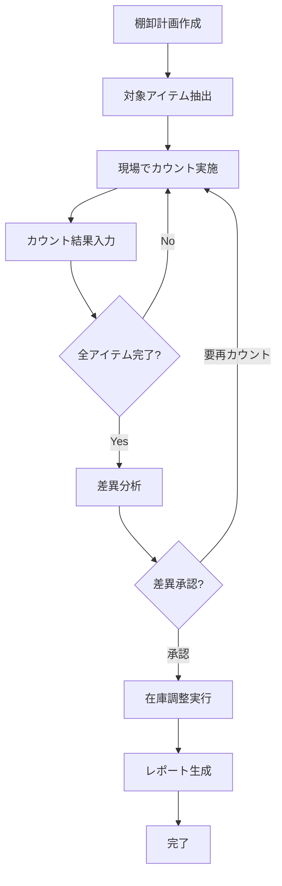
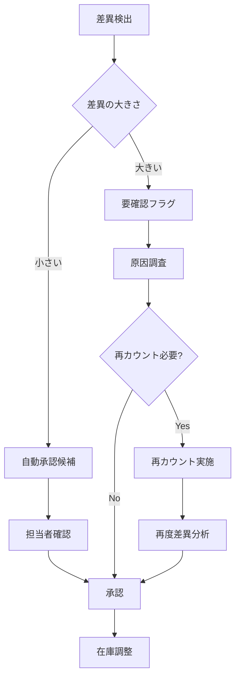
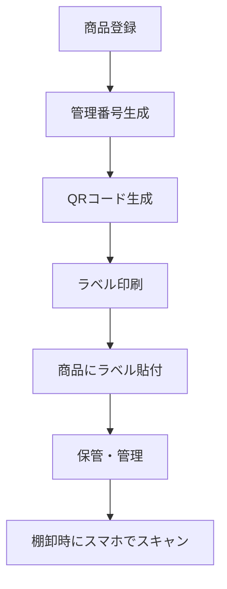
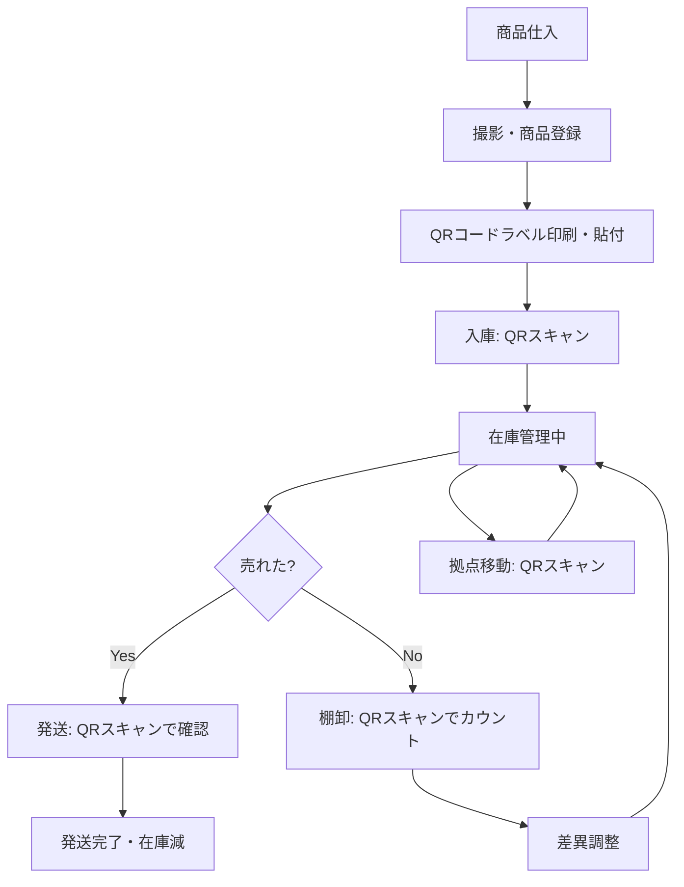

# 棚卸（在庫確認）機能設計書

**作成日**: 2025-11-17
**ステータス**: 設計フェーズ（未実装）
**優先度**: 将来実装予定

---

## 📋 目次

1. [概要](#概要)
2. [機能要件](#機能要件)
3. [画面設計](#画面設計)
4. [データベース設計](#データベース設計)
5. [ワークフロー](#ワークフロー)
6. [既存システムとの連携](#既存システムとの連携)
7. [技術実装アプローチ](#技術実装アプローチ)
8. [将来拡張性](#将来拡張性)
9. [バーコード運用戦略](#バーコード運用戦略)
10. [複数拠点管理](#複数拠点管理)
11. [ラベル印刷機能](#ラベル印刷機能)
12. [日常業務でのQRコード活用](#日常業務でのqrコード活用)
13. [棚卸頻度の考え方](#棚卸頻度の考え方)

---

## 概要

### 棚卸とは

**棚卸（Inventory Check/Physical Inventory Count）** は、定期的に実施する物理的な在庫確認作業です。

#### 日常的な在庫管理との違い

| 項目 | 日常的な在庫管理 | 棚卸 |
|------|----------------|------|
| **頻度** | 日次・随時 | 月次・年次（定期） |
| **目的** | 日々の入出庫記録 | 帳簿在庫と実在庫の突合 |
| **対象** | 主に商品 | 全資産（商品+梱包資材+備品） |
| **方法** | システム入力 | 物理的カウント |
| **結果** | 在庫数更新 | 差異検出→調整→会計反映 |

### 独立メニューとする理由

1. **横断的スコープ**: 商品だけでなく、梱包資材・備品も対象
2. **異なるワークフロー**: カウント→照合→差異分析→調整という特殊な流れ
3. **会計・監査要件**: 定期的な実施記録と証跡保持が必要
4. **専用UI**: 物理カウント入力に最適化された画面が必要

---

## 機能要件

### 必須機能（MVP）

#### 1. 棚卸計画作成
- 棚卸実施日設定
- 対象資産カテゴリ選択（商品/梱包資材/備品）
- 担当者割り当て
- カウント方式選択（全数/ABC分析/循環棚卸）

#### 2. カウント入力画面
- **モバイル最適化**: スマートフォンで現場入力
- **バーコードスキャン対応**: 商品管理番号読み取り
- **手動入力**: 資材・備品など
- **写真添付**: 証跡保持
- **オフライン対応**: ネットワーク不安定でも入力可能

#### 3. 差異分析
- 帳簿在庫 vs 実在庫の比較表示
- 差異率・差異金額の自動計算
- 差異原因コード入力（紛失/破損/カウントミス等）
- 閾値アラート（差異が大きい場合に警告）

#### 4. 在庫調整
- 差異を承認して実在庫に反映
- 調整仕訳の自動生成（将来的に会計連携）
- 調整履歴の記録

#### 5. 棚卸レポート
- 実施結果サマリー
- 差異分析レポート
- 担当者別進捗状況
- 過去実施履歴との比較

### 将来拡張機能

- **ABC分析連動**: 重要度に応じたカウント頻度設定
- **循環棚卸**: 毎月異なるカテゴリを実施
- **AIによる差異原因推定**: 過去データから原因を予測
- **会計システム連携**: 棚卸資産計上の自動化

---

## 画面設計

### 3.1 棚卸一覧画面

```
┌─────────────────────────────────────┐
│ ← 棚卸管理           🔍 検索  ➕ 新規 │
├─────────────────────────────────────┤
│                                     │
│ 📅 実施予定（2件）                   │
│ ┌─────────────────────────────────┐ │
│ │ 2025年11月棚卸                   │ │
│ │ 実施日: 11/30  担当: 山田太郎     │ │
│ │ 進捗: ━━━━━━━━━━ 65%            │ │
│ │        [続きから開始]            │ │
│ └─────────────────────────────────┘ │
│                                     │
│ 📊 完了済（3件）                     │
│ ┌─────────────────────────────────┐ │
│ │ 2025年10月棚卸  ✅ 完了           │ │
│ │ 差異: ±2.3%  調整済              │ │
│ │        [レポート表示]            │ │
│ └─────────────────────────────────┘ │
│                                     │
└─────────────────────────────────────┘
```

### 3.2 棚卸計画作成画面

```
┌─────────────────────────────────────┐
│ ← 棚卸計画作成                       │
├─────────────────────────────────────┤
│                                     │
│ 📝 基本情報                          │
│ ┌─────────────────────────────────┐ │
│ │ 棚卸名称: [2025年11月棚卸]       │ │
│ │ 実施日:   [2025-11-30] 📅        │ │
│ │ 担当者:   [山田太郎 ▼]           │ │
│ └─────────────────────────────────┘ │
│                                     │
│ 📦 対象資産                          │
│ ┌─────────────────────────────────┐ │
│ │ ☑ 商品在庫（457点）              │ │
│ │ ☑ 梱包資材（23種類）             │ │
│ │ ☐ 備品（12種類）                 │ │
│ └─────────────────────────────────┘ │
│                                     │
│ 🎯 カウント方式                      │
│ ┌─────────────────────────────────┐ │
│ │ ○ 全数棚卸（全アイテム）         │ │
│ │ ○ ABC分析（重要度別）            │ │
│ │ ○ 循環棚卸（カテゴリ別）         │ │
│ └─────────────────────────────────┘ │
│                                     │
│         [キャンセル]  [作成開始]     │
│                                     │
└─────────────────────────────────────┘
```

### 3.3 カウント入力画面（モバイル最適化）

```
┌─────────────────────────────────────┐
│ ← 棚卸カウント入力    進捗: 65/100  │
├─────────────────────────────────────┤
│                                     │
│ 📷 [バーコードスキャン]              │
│                                     │
│ または手動入力:                      │
│ ┌─────────────────────────────────┐ │
│ │ 管理番号: [________] 🔍          │ │
│ └─────────────────────────────────┘ │
│                                     │
│ 📦 対象アイテム                      │
│ ┌─────────────────────────────────┐ │
│ │ ブランド: CHANEL                 │ │
│ │ カテゴリ: トップス/Tシャツ       │ │
│ │ サイズ: M  カラー: ブラック      │ │
│ │                                 │ │
│ │ 📊 帳簿在庫: 3点                 │ │
│ │ 📝 実在庫: [____] 点 入力        │ │
│ │                                 │ │
│ │ 💬 備考（任意）:                 │ │
│ │ [___________________________]   │ │
│ │                                 │ │
│ │ 📷 [写真を追加]                  │ │
│ └─────────────────────────────────┘ │
│                                     │
│       [スキップ]  [次へ（保存）]    │
│                                     │
└─────────────────────────────────────┘
```

### 3.4 差異分析画面

```
┌─────────────────────────────────────┐
│ ← 差異分析                           │
├─────────────────────────────────────┤
│                                     │
│ 📊 サマリー                          │
│ ┌─────────────────────────────────┐ │
│ │ カウント完了: 457点              │ │
│ │ 差異あり:     23点（5.0%）       │ │
│ │ 過不足金額:   -¥12,450          │ │
│ └─────────────────────────────────┘ │
│                                     │
│ ⚠️ 差異大（要確認: 5点）             │
│ ┌─────────────────────────────────┐ │
│ │ CHANEL Tシャツ M ブラック        │ │
│ │ 帳簿: 3点 → 実在庫: 1点 (-2)    │ │
│ │ 差異原因: [紛失 ▼]               │ │
│ │         [再カウント] [承認]      │ │
│ └─────────────────────────────────┘ │
│                                     │
│ ✅ 差異小（自動承認可: 18点）        │
│ ┌─────────────────────────────────┐ │
│ │ [一覧を表示]                     │ │
│ └─────────────────────────────────┘ │
│                                     │
│    [全て再カウント]  [差異を承認]   │
│                                     │
└─────────────────────────────────────┘
```

### 3.5 棚卸レポート画面

```
┌─────────────────────────────────────┐
│ ← 棚卸レポート        📥 PDF出力    │
├─────────────────────────────────────┤
│                                     │
│ 2025年11月棚卸 - 実施結果            │
│                                     │
│ 📅 実施情報                          │
│ ┌─────────────────────────────────┐ │
│ │ 実施日: 2025-11-30              │ │
│ │ 担当者: 山田太郎                 │ │
│ │ 対象: 商品457点+梱包資材23種     │ │
│ └─────────────────────────────────┘ │
│                                     │
│ 📊 差異サマリー                      │
│ ┌─────────────────────────────────┐ │
│ │ 差異率:     5.0%                │ │
│ │ 差異金額:   -¥12,450            │ │
│ │ 調整点数:   23点                │ │
│ └─────────────────────────────────┘ │
│                                     │
│ 🔍 差異原因分析                      │
│ ┌─────────────────────────────────┐ │
│ │ 紛失:       12点（52%）         │ │
│ │ 破損:        5点（22%）         │ │
│ │ カウントミス: 4点（17%）         │ │
│ │ その他:      2点（9%）          │ │
│ └─────────────────────────────────┘ │
│                                     │
│ 📈 過去比較                          │
│ ┌─────────────────────────────────┐ │
│ │ [グラフ: 差異率推移]             │ │
│ └─────────────────────────────────┘ │
│                                     │
└─────────────────────────────────────┘
```

---

## データベース設計

### 4.1 Firestore コレクション構造

#### inventoryChecks（棚卸計画）

```javascript
{
  checkId: "IC-2025-11-001",
  name: "2025年11月棚卸",
  scheduledDate: Timestamp(2025-11-30),
  status: "in_progress", // "planned" | "in_progress" | "completed" | "cancelled"
  assignedTo: "山田太郎",
  targetCategories: ["products", "packaging", "supplies"],
  countMethod: "full", // "full" | "abc" | "cycle"
  createdAt: Timestamp,
  createdBy: "admin@example.com",
  updatedAt: Timestamp,

  // 拠点情報（複数拠点対応）
  targetLocations: ["LOC-001", "LOC-002", "LOC-003"], // 対象拠点
  locationProgress: {
    "LOC-001": { total: 150, counted: 120, percentage: 80, assignedTo: "社員A" },
    "LOC-002": { total: 50, counted: 50, percentage: 100, assignedTo: "山田さん" },
    "LOC-003": { total: 30, counted: 18, percentage: 60, assignedTo: "佐藤さん" }
  },

  // 進捗情報
  progress: {
    totalItems: 457,
    countedItems: 297,
    percentage: 65
  },

  // 差異サマリー（完了後）
  summary: {
    totalDiscrepancies: 23,
    discrepancyRate: 5.0,
    discrepancyAmount: -12450,
    adjustedItems: 23
  }
}
```

#### inventoryCheckItems（カウント結果）

```javascript
{
  checkId: "IC-2025-11-001",
  itemId: "PROD-001234", // 商品管理番号
  itemType: "product", // "product" | "packaging" | "supply"

  // 拠点情報
  locationId: "LOC-002", // この商品が保管されている拠点

  // 商品情報（スナップショット）
  itemSnapshot: {
    name: "CHANEL Tシャツ M ブラック",
    brand: "CHANEL",
    category: "トップス/Tシャツ",
    size: "M",
    color: "ブラック",
    currentLocation: "LOC-002" // 商品の現在地
  },

  // カウント情報
  bookQuantity: 3, // 帳簿在庫
  physicalQuantity: 1, // 実在庫
  discrepancy: -2, // 差異
  discrepancyRate: -66.7, // 差異率

  // 差異詳細
  discrepancyReason: "lost", // "lost" | "damaged" | "count_error" | "other"
  notes: "再カウント実施済み、紛失と判断",
  photos: ["gs://bucket/photo1.jpg"],

  // カウント実施情報
  countedAt: Timestamp,
  countedBy: "山田太郎",
  isAdjusted: true, // 調整済みか
  adjustedAt: Timestamp,
  adjustedBy: "管理者"
}
```

#### inventoryAdjustments（在庫調整履歴）

```javascript
{
  adjustmentId: "ADJ-2025-11-001",
  checkId: "IC-2025-11-001",
  itemId: "PROD-001234",

  // 調整内容
  beforeQuantity: 3,
  afterQuantity: 1,
  adjustmentAmount: -2,
  reason: "棚卸差異調整（紛失）",

  // 会計連携（将来）
  accountingEntry: {
    debit: "棚卸差損",
    credit: "商品",
    amount: 4200
  },

  // メタ情報
  createdAt: Timestamp,
  createdBy: "管理者",
  approvedBy: "経理担当"
}
```

### 4.2 Google Sheets 構造（既存システム連携）

既存の在庫管理シートに以下の列を追加することを検討：

| 列名 | 説明 |
|------|------|
| 最終棚卸日 | 最後にカウントされた日付 |
| 棚卸差異履歴 | 過去の差異記録（JSON） |
| 棚卸注意フラグ | 差異が多い商品にフラグ |

---

## ワークフロー

### 5.1 棚卸実施フロー



### 5.2 差異承認ワークフロー



---

## 既存システムとの連携

### 6.1 在庫管理システムとの連携

| 連携ポイント | データの流れ | 説明 |
|-------------|------------|------|
| 帳簿在庫取得 | 在庫管理 → 棚卸 | カウント時の比較基準 |
| 実在庫反映 | 棚卸 → 在庫管理 | 差異調整後の在庫更新 |
| 入出庫ロック | 棚卸 ⇄ 在庫管理 | 棚卸中の在庫変動防止 |

### 6.2 商品登録システムとの連携

- **商品マスタ参照**: 商品情報のスナップショット取得
- **管理番号検索**: バーコードスキャン時の商品特定

### 6.3 会計システムとの連携（将来）

- **棚卸資産計上**: 差異調整の仕訳自動生成
- **棚卸減耗損**: 紛失・破損の費用計上

---

## 技術実装アプローチ

### 7.1 技術スタック

| レイヤー | 技術 | 説明 |
|---------|------|------|
| フロントエンド | PWA (HTML/CSS/JS) | モバイル対応、オフライン動作 |
| バックエンド | Google Apps Script | 既存システムとの統合 |
| データベース | Firestore | リアルタイム同期、オフライン対応 |
| ストレージ | Cloud Storage | 写真保存 |
| 認証 | Firebase Auth | 既存認証システム統合 |

### 7.2 オフライン対応

棚卸は現場作業のため、ネットワークが不安定な環境でも動作する必要があります。

```javascript
// Service Worker でオフラインキャッシュ
self.addEventListener('fetch', (event) => {
  event.respondWith(
    caches.match(event.request).then((response) => {
      return response || fetch(event.request);
    })
  );
});

// Firestore のオフライン永続化
firebase.firestore().enablePersistence()
  .catch((err) => {
    if (err.code === 'failed-precondition') {
      console.warn('複数タブでオフライン永続化は不可');
    }
  });
```

### 7.3 バーコードスキャン実装

```javascript
// HTML5 getUserMedia API を使用
const video = document.createElement('video');
navigator.mediaDevices.getUserMedia({ video: { facingMode: 'environment' } })
  .then((stream) => {
    video.srcObject = stream;
    video.play();

    // Quagga.js などのバーコード読み取りライブラリを使用
    Quagga.init({
      inputStream: { type: 'LiveStream', target: video },
      decoder: { readers: ['code_128_reader', 'ean_reader'] }
    }, (err) => {
      if (!err) Quagga.start();
    });

    Quagga.onDetected((result) => {
      const code = result.codeResult.code;
      // 商品検索処理
      searchProductByCode(code);
    });
  });
```

### 7.4 差異検出アルゴリズム

```javascript
/**
 * 差異を検出し、閾値に基づいて自動承認候補を判定
 */
function analyzeDiscrepancy(bookQty, physicalQty, itemValue) {
  const discrepancy = physicalQty - bookQty;
  const discrepancyRate = Math.abs(discrepancy / bookQty) * 100;
  const discrepancyAmount = discrepancy * itemValue;

  // 閾値設定
  const AUTO_APPROVE_RATE = 5; // 5%以下
  const AUTO_APPROVE_AMOUNT = 1000; // ¥1,000以下

  const autoApprove = (
    discrepancyRate <= AUTO_APPROVE_RATE &&
    Math.abs(discrepancyAmount) <= AUTO_APPROVE_AMOUNT
  );

  return {
    discrepancy,
    discrepancyRate,
    discrepancyAmount,
    requiresReview: !autoApprove,
    severity: discrepancyRate > 20 ? 'high' : (discrepancyRate > 10 ? 'medium' : 'low')
  };
}
```

---

## 将来拡張性

### 8.1 ABC分析連動

商品の重要度（売上貢献度）に応じて棚卸頻度を変える：

- **Aランク**: 毎月棚卸（高額商品、回転率高）
- **Bランク**: 四半期ごと（中額商品）
- **Cランク**: 年1回（低額商品、回転率低）

### 8.2 循環棚卸

毎月異なるカテゴリを棚卸し、年間を通して全在庫をカバー：

```
1月: トップス
2月: ボトムス
3月: バッグ
...
12月: アクセサリー
```

### 8.3 AIによる差異原因予測

過去の棚卸データを機械学習で分析し、差異原因を自動推定：

```javascript
// 過去データから学習したモデルで予測
const predictedReason = await aiModel.predict({
  itemCategory: "トップス",
  discrepancyRate: -66.7,
  locationCode: "SHELF-A-12",
  lastSaleDate: "2025-11-15",
  seasonality: "winter"
});

// 予測結果: "lost" (信頼度: 85%)
```

### 8.4 RFID対応

将来的にRFIDタグを導入した場合、一括読み取りでカウント時間を大幅短縮：

```javascript
// RFIDリーダーから一括取得
const scannedItems = await rfidReader.scan();
// 一度に100点以上のアイテムを瞬時にカウント
```

---

## 実装優先順位

### Phase 1（MVP）- 3ヶ月

1. ✅ メニュー追加（完了）
2. 棚卸計画作成機能
3. カウント入力画面（手動入力のみ）
4. 差異分析・承認機能
5. 基本レポート

### Phase 2 - 6ヶ月

1. バーコードスキャン対応
2. オフライン動作対応
3. 写真添付機能
4. 梱包資材・備品対応

### Phase 3 - 9ヶ月

1. ABC分析連動
2. 循環棚卸対応
3. 高度なレポート・分析
4. モバイルアプリ化

### Phase 4 - 12ヶ月

1. 会計システム連携
2. AI差異原因予測
3. RFID対応（ハードウェア導入後）

---

## バーコード運用戦略

### 9.1 バーコード導入の前提条件

**重要**: バーコードスキャン機能を使うには、**商品にバーコード（QRコード）ラベルを事前に貼付する必要があります**。

### 9.2 運用フロー全体像



**詳細フロー**:
```
1. 商品登録（product_register_firestore.html）
   ↓
   管理番号生成: CH-TS-M-BK-001
   ↓
2. QRコード自動生成 ← ★商品登録画面に機能追加
   ↓
3. ラベル印刷ボタンクリック
   ↓
   [QRコードラベル印刷]
   ↓
4. 商品にラベル貼付（手作業）
   ↓
5. 保管・発送準備
   ↓
6. 棚卸時: スマホカメラでQRコードスキャン → 自動的に商品情報取得
```

### 9.3 QRコード vs バーコード比較

| 項目 | QRコード（推奨） | バーコード（1次元） |
|------|----------------|------------------|
| **情報量** | 多い（管理番号 + URL + 商品名） | 少ない（管理番号のみ） |
| **読み取り精度** | ◎ 高い（汚れに強い） | △ 普通 |
| **スマホ対応** | ◎ 標準カメラアプリでも読める | △ 専用ライブラリ必要 |
| **印刷サイズ** | 小さくてOK（2cm角） | 横長が必要（5cm×1cm） |
| **追加機能** | 商品詳細URLにリンク可能 | なし |
| **エラー訂正** | ◎ あり（30%破損でも読取可） | △ 弱い |
| **実装難易度** | ○ 簡単（ライブラリ豊富） | △ やや難 |

**結論**: **QRコード推奨**

### 9.4 スマホでのQRコードスキャン実装

#### ✅ PWAブラウザ上で完全に動作（専用アプリ不要）

**動作環境**:
- iPhone（Safari）: ✅ 対応
- Android（Chrome）: ✅ 対応
- 既存のREBORN PWAに組み込み可能

**実装例（html5-qrcode ライブラリ使用）**:

```javascript
// QRコードスキャン機能
import { Html5Qrcode } from "html5-qrcode";

// カメラ起動（背面カメラ優先）
const html5QrCode = new Html5Qrcode("qr-reader");

html5QrCode.start(
  { facingMode: "environment" }, // 背面カメラ
  {
    fps: 10, // スキャン頻度
    qrbox: { width: 250, height: 250 } // スキャン枠
  },
  (decodedText, decodedResult) => {
    // QRコード読み取り成功
    console.log(`読み取った管理番号: ${decodedText}`);

    // 商品情報をFirestoreから取得
    searchProductByManagementNumber(decodedText);

    // カメラ停止
    html5QrCode.stop();
  },
  (errorMessage) => {
    // 読み取り失敗（無視してOK）
  }
);
```

**使用できるライブラリ**:
1. **html5-qrcode**: 最も簡単、QRコード+バーコード対応、軽量
2. **QuaggaJS**: 高精度、様々なバーコード形式対応
3. **ZXing**: Google製、信頼性高い、やや重い

### 9.5 運用の選択肢（段階的導入）

#### オプション1: フル導入（理想形）

**対象**: 全商品にQRコードラベル貼付

```
全商品（457点）にQRコードラベル
↓
棚卸時はスマホでスキャンのみ
↓
1点あたり1秒で完了（高速・正確）
```

**メリット**:
- ✅ 最速（457点を約7分で完了）
- ✅ 入力ミスなし
- ✅ 手間が最小限

**デメリット**:
- ❌ 初期ラベル貼付作業が発生（457点）
- ❌ ラベルプリンター購入が必要（推奨）

#### オプション2: ハイブリッド導入（現実的）

**対象**: 重要商品のみQRコード、その他は手動入力

```
高額商品（Aランク: 50点）→ QRコードラベル
中額商品（Bランク: 200点）→ 手動入力（管理番号検索）
低額商品（Cランク: 207点）→ カテゴリ一括カウント
```

**メリット**:
- ✅ 段階的に導入可能
- ✅ 初期コスト最小
- ✅ 重要商品の正確性確保

**デメリット**:
- △ 一部は手動入力が残る

#### オプション3: 手動のみ（最小構成）

**対象**: 全て手動入力

```
管理番号を手入力 or 商品名検索
↓
該当商品を選択
↓
実在庫数を入力
```

**メリット**:
- ✅ すぐ始められる（追加機器不要）
- ✅ 運用シンプル

**デメリット**:
- ❌ 時間がかかる（1点あたり10-20秒）
- ❌ 入力ミスリスク

### 9.6 推奨アプローチ

**Phase 1**: オプション3（手動のみ）でスタート
- ラベル印刷機能未実装でも棚卸機能を使える
- 運用を確立

**Phase 2**: ラベル印刷機能追加（商品登録時）
- 新規商品からQRコードラベル貼付開始
- 既存商品は徐々に移行

**Phase 3**: オプション2（ハイブリッド）運用
- 重要商品はQRコード化完了
- 効率大幅アップ

**Phase 4**: オプション1（フル導入）
- 全商品QRコード化完了
- 最速・最正確な棚卸実現

### 9.7 QRコード生成仕様

**格納データ**:
```
管理番号: CH-TS-M-BK-001

または

URL形式: https://reborn-inventory-system.pages.dev/inventory?id=CH-TS-M-BK-001
```

**URL形式の利点**:
- スマホ標準カメラでスキャン → ブラウザで商品詳細画面が開く
- REBORNシステムにログインしていれば、即座に商品情報確認可能

---

## 複数拠点管理

### 10.1 概要

**想定シナリオ**: 在庫が複数の場所で管理される

| 拠点 | 担当者 | 保管商品例 | 商品数 |
|------|--------|----------|--------|
| **本社倉庫** | 社員A | 新規仕入れ商品、高額品 | 150点 |
| **外注スタッフ①自宅** | 山田さん | 梱包・発送待ち商品 | 50点 |
| **外注スタッフ②自宅** | 佐藤さん | クリーニング中商品 | 30点 |
| **提携倉庫** | 業者C | 大型商品、季節商品 | 227点 |

### 10.2 拠点マスタ管理

#### 10.2.1 拠点マスタデータ構造

**Firestoreコレクション: `locations`**

```javascript
{
  locationId: "LOC-001",
  locationName: "本社倉庫",
  locationType: "main_warehouse", // "main_warehouse" | "staff_home" | "partner_warehouse"
  address: "東京都〇〇区〇〇1-2-3",
  postalCode: "123-4567",

  // 担当者情報
  assignedTo: {
    userId: "user-001",
    userName: "社員A",
    email: "employee-a@example.com",
    phone: "090-1234-5678"
  },

  // アクセス権限
  accessControl: {
    viewAllProducts: true, // 全商品閲覧可能
    editAllProducts: true, // 全商品編集可能
    restrictedToLocation: false // 自拠点のみに制限
  },

  // 在庫サマリー
  inventorySummary: {
    totalProducts: 150,
    totalValue: 2500000,
    lastUpdated: Timestamp
  },

  createdAt: Timestamp,
  updatedAt: Timestamp,
  isActive: true
}
```

**外注スタッフ自宅の例**:
```javascript
{
  locationId: "LOC-002",
  locationName: "外注スタッフ①（山田さん自宅）",
  locationType: "staff_home",
  address: "神奈川県〇〇市〇〇2-3-4",

  assignedTo: {
    userId: "user-002",
    userName: "山田さん",
    email: "yamada@example.com",
    phone: "080-2345-6789"
  },

  accessControl: {
    viewAllProducts: false, // 全商品は見えない
    editAllProducts: false,
    restrictedToLocation: true // 自分の拠点の商品のみ
  },

  inventorySummary: {
    totalProducts: 50,
    totalValue: 350000,
    lastUpdated: Timestamp
  }
}
```

#### 10.2.2 商品データへの拠点情報追加

**既存商品データに追加するフィールド**:

```javascript
// product_register_firestore.html で登録する商品データに追加
{
  managementNumber: "CH-TS-M-BK-001",
  brand: "CHANEL",
  category: "トップス/Tシャツ",
  // ... 他の商品情報 ...

  // 拠点情報（新規追加）
  currentLocation: "LOC-002", // 現在の保管拠点
  locationHistory: [
    {
      locationId: "LOC-001",
      locationName: "本社倉庫",
      movedAt: Timestamp(2025-11-10),
      movedBy: "社員A",
      reason: "入庫（仕入）"
    },
    {
      locationId: "LOC-002",
      locationName: "外注スタッフ①（山田さん自宅）",
      movedAt: Timestamp(2025-11-15),
      movedBy: "社員A",
      reason: "梱包・発送準備のため移動"
    }
  ]
}
```

### 10.3 拠点別棚卸機能

#### 10.3.1 拠点別棚卸計画

**シナリオ**: 2025年11月30日に全拠点で棚卸実施

```javascript
{
  checkId: "IC-2025-11-001",
  name: "2025年11月棚卸（全拠点）",
  scheduledDate: Timestamp(2025-11-30),

  // 対象拠点
  targetLocations: ["LOC-001", "LOC-002", "LOC-003", "LOC-004"],

  // 拠点別進捗（リアルタイム更新）
  locationProgress: {
    "LOC-001": {
      locationName: "本社倉庫",
      total: 150,
      counted: 120,
      percentage: 80,
      assignedTo: "社員A",
      status: "in_progress"
    },
    "LOC-002": {
      locationName: "外注スタッフ①（山田さん自宅）",
      total: 50,
      counted: 50,
      percentage: 100,
      assignedTo: "山田さん",
      status: "completed" // 完了
    },
    "LOC-003": {
      locationName: "外注スタッフ②（佐藤さん自宅）",
      total: 30,
      counted: 18,
      percentage: 60,
      assignedTo: "佐藤さん",
      status: "in_progress"
    },
    "LOC-004": {
      locationName: "提携倉庫",
      total: 227,
      counted: 0,
      percentage: 0,
      assignedTo: "業者C",
      status: "not_started"
    }
  }
}
```

#### 10.3.2 管理者画面（全拠点統合ビュー）

```
┌─────────────────────────────────────┐
│ ← 2025年11月棚卸          全体進捗: 41% │
├─────────────────────────────────────┤
│                                     │
│ 📊 拠点別進捗状況                    │
│                                     │
│ ✅ LOC-002: 外注①（山田さん）100%    │
│ ┌─────────────────────────────────┐ │
│ │ ━━━━━━━━━━━━━━━━━━━━ 50/50点   │ │
│ │ 完了: 11/30 14:30               │ │
│ └─────────────────────────────────┘ │
│                                     │
│ 🔄 LOC-001: 本社倉庫           80%   │
│ ┌─────────────────────────────────┐ │
│ │ ━━━━━━━━━━━━━━━━░░░░ 120/150点  │ │
│ │ 担当: 社員A  進行中              │ │
│ └─────────────────────────────────┘ │
│                                     │
│ 🔄 LOC-003: 外注②（佐藤さん）  60%   │
│ ┌─────────────────────────────────┐ │
│ │ ━━━━━━━━━━━━░░░░░░░░ 18/30点   │ │
│ │ 担当: 佐藤さん  進行中           │ │
│ └─────────────────────────────────┘ │
│                                     │
│ ⏳ LOC-004: 提携倉庫            0%   │
│ ┌─────────────────────────────────┐ │
│ │ ░░░░░░░░░░░░░░░░░░░░ 0/227点   │ │
│ │ 担当: 業者C  未開始              │ │
│ └─────────────────────────────────┘ │
│                                     │
└─────────────────────────────────────┘
```

#### 10.3.3 担当者画面（自拠点のみ表示）

**山田さんがログインした場合**（LOC-002のみ閲覧可能）:

```
┌─────────────────────────────────────┐
│ ← 棚卸カウント        進捗: 50/50  │
├─────────────────────────────────────┤
│                                     │
│ 📍 対象拠点: 外注①（山田さん自宅）   │
│                                     │
│ ✅ カウント完了しました！            │
│                                     │
│ 📊 結果サマリー                      │
│ ┌─────────────────────────────────┐ │
│ │ カウント完了: 50点               │ │
│ │ 差異あり:     3点（6.0%）        │ │
│ │ 過不足金額:   -¥2,100           │ │
│ └─────────────────────────────────┘ │
│                                     │
│         [差異分析へ進む]             │
│                                     │
└─────────────────────────────────────┘
```

### 10.4 拠点マスタ管理画面（新規追加）

#### 10.4.1 拠点一覧画面

```
┌─────────────────────────────────────┐
│ ← 拠点マスタ管理      🔍 検索  ➕ 新規 │
├─────────────────────────────────────┤
│                                     │
│ 📍 登録拠点（4件）                   │
│                                     │
│ ┌─────────────────────────────────┐ │
│ │ 🏢 本社倉庫（LOC-001）            │ │
│ │ 担当: 社員A  在庫: 150点          │ │
│ │ 東京都〇〇区〇〇1-2-3             │ │
│ │        [詳細] [編集] [削除]      │ │
│ └─────────────────────────────────┘ │
│                                     │
│ ┌─────────────────────────────────┐ │
│ │ 🏠 外注①（山田さん自宅）          │ │
│ │ 担当: 山田さん  在庫: 50点        │ │
│ │ 神奈川県〇〇市〇〇2-3-4           │ │
│ │        [詳細] [編集] [削除]      │ │
│ └─────────────────────────────────┘ │
│                                     │
└─────────────────────────────────────┘
```

#### 10.4.2 拠点登録画面

```
┌─────────────────────────────────────┐
│ ← 拠点登録                           │
├─────────────────────────────────────┤
│                                     │
│ 📝 基本情報                          │
│ ┌─────────────────────────────────┐ │
│ │ 拠点名称: [___________________] │ │
│ │ 拠点種別: [外注スタッフ自宅 ▼]   │ │
│ │ 郵便番号: [___-____]             │ │
│ │ 住所:     [___________________] │ │
│ └─────────────────────────────────┘ │
│                                     │
│ 👤 担当者情報                        │
│ ┌─────────────────────────────────┐ │
│ │ 担当者名: [___________________] │ │
│ │ メール:   [___________________] │ │
│ │ 電話:     [___________________] │ │
│ └─────────────────────────────────┘ │
│                                     │
│ 🔐 アクセス権限                      │
│ ┌─────────────────────────────────┐ │
│ │ ☐ 全商品閲覧可能                 │ │
│ │ ☑ 自拠点の商品のみ               │ │
│ └─────────────────────────────────┘ │
│                                     │
│         [キャンセル]  [登録]         │
│                                     │
└─────────────────────────────────────┘
```

### 10.5 商品の拠点間移動

#### 10.5.1 移動記録画面

```
┌─────────────────────────────────────┐
│ ← 拠点間移動記録                     │
├─────────────────────────────────────┤
│                                     │
│ 📦 対象商品                          │
│ ┌─────────────────────────────────┐ │
│ │ 管理番号: CH-TS-M-BK-001         │ │
│ │ ブランド: CHANEL                 │ │
│ │ 現在地: 本社倉庫（LOC-001）       │ │
│ └─────────────────────────────────┘ │
│                                     │
│ 🚚 移動先                            │
│ ┌─────────────────────────────────┐ │
│ │ [外注①（山田さん自宅） ▼]        │ │
│ └─────────────────────────────────┘ │
│                                     │
│ 📝 移動理由                          │
│ ┌─────────────────────────────────┐ │
│ │ [梱包・発送準備のため ▼]         │ │
│ │ 備考: [_____________________]   │ │
│ └─────────────────────────────────┘ │
│                                     │
│         [キャンセル]  [移動実行]     │
│                                     │
└─────────────────────────────────────┘
```

#### 10.5.2 移動履歴表示

```
┌─────────────────────────────────────┐
│ ← CH-TS-M-BK-001 移動履歴            │
├─────────────────────────────────────┤
│                                     │
│ 📍 現在地: 外注①（山田さん自宅）     │
│                                     │
│ 📜 移動履歴                          │
│                                     │
│ ┌─────────────────────────────────┐ │
│ │ 2025-11-15 14:30                │ │
│ │ 本社倉庫 → 外注①（山田さん）     │ │
│ │ 理由: 梱包・発送準備             │ │
│ │ 実施者: 社員A                    │ │
│ └─────────────────────────────────┘ │
│                                     │
│ ┌─────────────────────────────────┐ │
│ │ 2025-11-10 09:00                │ │
│ │ 入庫 → 本社倉庫                  │ │
│ │ 理由: 仕入                       │ │
│ │ 実施者: 社員A                    │ │
│ └─────────────────────────────────┘ │
│                                     │
└─────────────────────────────────────┘
```

---

## ラベル印刷機能

### 11.1 機能概要

商品登録完了時にQRコードラベルを印刷できる機能を商品登録画面に追加。

### 11.2 商品登録画面への追加UI

#### 登録完了画面にQRコードプレビューと印刷ボタン追加

```
┌─────────────────────────────────────┐
│ 商品登録完了                         │
├─────────────────────────────────────┤
│                                     │
│ ✅ 登録が完了しました                │
│                                     │
│ 📦 管理番号: CH-TS-M-BK-001         │
│                                     │
│ 🏷️ QRコードラベル                   │
│ ┌─────────────────────────────────┐ │
│ │                                 │ │
│ │      ▓▓▓▓▓▓▓▓▓▓▓▓▓▓▓▓          │ │
│ │      ▓▓░░░░░░░░░░░░▓▓          │ │
│ │      ▓▓░░▓▓▓▓▓▓░░▓▓          │ │
│ │      ▓▓░░▓▓░░▓▓░░▓▓          │ │
│ │      ▓▓░░▓▓░░▓▓░░▓▓          │ │
│ │      ▓▓░░▓▓▓▓▓▓░░▓▓          │ │
│ │      ▓▓░░░░░░░░░░░░▓▓          │ │
│ │      ▓▓▓▓▓▓▓▓▓▓▓▓▓▓▓▓          │ │
│ │                                 │ │
│ │    CH-TS-M-BK-001               │ │
│ │    CHANEL Tシャツ M ブラック     │ │
│ │                                 │ │
│ └─────────────────────────────────┘ │
│                                     │
│   [🖨️ ラベルを印刷]  [📋 次の商品]  │
│                                     │
└─────────────────────────────────────┘
```

### 11.3 QRコード生成実装

```javascript
// QRコード生成（qrcode.js ライブラリ使用）
function generateQRCode(managementNumber, productInfo) {
  // QRコードに格納するデータ
  const qrData = {
    type: "product",
    managementNumber: managementNumber,
    url: `https://reborn-inventory-system.pages.dev/inventory?id=${managementNumber}`,
    productName: `${productInfo.brand} ${productInfo.category} ${productInfo.size} ${productInfo.color}`
  };

  // QRコード生成
  const qrCodeDataURL = QRCode.toDataURL(JSON.stringify(qrData), {
    width: 200,
    margin: 2,
    errorCorrectionLevel: 'M' // エラー訂正レベル（破損30%まで読取可）
  });

  return qrCodeDataURL;
}

// ラベル印刷
function printLabel(managementNumber, productInfo, qrCodeDataURL) {
  // 印刷用HTMLを生成
  const printWindow = window.open('', '_blank');
  printWindow.document.write(`
    <!DOCTYPE html>
    <html>
    <head>
      <title>QRコードラベル - ${managementNumber}</title>
      <style>
        @media print {
          @page { size: 62mm 29mm; margin: 0; }
          body { margin: 0; padding: 5mm; }
        }
        .label {
          width: 62mm;
          height: 29mm;
          display: flex;
          flex-direction: column;
          align-items: center;
          justify-content: center;
          font-family: Arial, sans-serif;
        }
        .qr-code {
          width: 50mm;
          height: 50mm;
        }
        .product-info {
          font-size: 10pt;
          text-align: center;
          margin-top: 2mm;
        }
        .management-number {
          font-size: 12pt;
          font-weight: bold;
          margin-top: 1mm;
        }
      </style>
    </head>
    <body>
      <div class="label">
        
        <div class="product-info">${productInfo.brand} ${productInfo.category}</div>
        <div class="management-number">${managementNumber}</div>
      </div>
    </body>
    </html>
  `);

  printWindow.document.close();
  printWindow.print();
}
```

### 11.4 推奨ラベルプリンター

#### 11.4.1 小規模運用（月10〜50点）

**普通のプリンター + シール用紙**

| 項目 | 詳細 |
|------|------|
| **機器** | 既存のインクジェット/レーザープリンター |
| **用紙** | A4シール用紙（24面付など） |
| **価格** | ¥1,000〜2,000（用紙のみ） |
| **メリット** | 追加機器不要、すぐ始められる |
| **デメリット** | 1枚ずつ切り離す手間、用紙コスト高 |

**おすすめ用紙**:
- エーワン ラベルシール A4 24面付（62mm×29mm）
- ヒサゴ QRコードラベル A4 30面付

#### 11.4.2 中規模運用（月50〜200点）

**Brother QL-820NWB（推奨）**

| 項目 | 詳細 |
|------|------|
| **価格** | ¥20,000〜25,000 |
| **接続** | WiFi、Bluetooth、USB |
| **対応ラベル** | 29mm〜62mm幅テープ |
| **印刷速度** | 最大110枚/分 |
| **メリット** | WiFi経由でスマホ・PCから直接印刷、専用アプリあり |
| **デメリット** | 専用ラベルテープ必要（ランニングコスト） |

**ランニングコスト**:
- DK-1201（29mm×90mm）: ¥2,500/400枚 → 約¥6/枚

#### 11.4.3 大規模運用（月200点以上）

**DYMO LabelWriter 450 Turbo**

| 項目 | 詳細 |
|------|------|
| **価格** | ¥30,000〜40,000 |
| **印刷速度** | 最大71枚/分 |
| **特徴** | 高速、大量印刷向け |

### 11.5 ラベルサイズ推奨仕様

| 用途 | サイズ | 内容 |
|------|--------|------|
| **商品ラベル** | 62mm × 29mm | QRコード + 管理番号 + 商品名（簡易） |
| **梱包資材ラベル** | 62mm × 29mm | QRコード + 資材名 + ロット番号 |
| **備品ラベル** | 29mm × 90mm | QRコード縦置き + 備品名 |

### 11.6 ラベルデザインバリエーション

#### パターンA: QRコード中心（推奨）

```
┌──────────────────┐
│                  │
│   [QRコード]     │
│                  │
│  CH-TS-M-BK-001  │
│ CHANEL Tシャツ M │
└──────────────────┘
```

#### パターンB: QRコード + 詳細情報

```
┌──────────────────┐
│  [QRコード]      │
│  CH-TS-M-BK-001  │
│  CHANEL          │
│  トップス/Tシャツ│
│  M / ブラック    │
│  ¥45,000         │
└──────────────────┘
```

### 11.7 実装優先順位（更新）

#### Phase 1（MVP）- バーコードなし
```
✅ 手動入力のみで棚卸可能
   - 管理番号を手入力
   - または商品名で検索
   - ラベル印刷機能なし
```

#### Phase 2 - ラベル印刷機能追加
```
✅ 商品登録時にQRコード生成
✅ ブラウザから印刷機能（window.print()）
✅ 普通のプリンター + シール用紙で運用可能
✅ 新規商品からQRコードラベル貼付開始
```

#### Phase 3 - バーコードスキャン実装
```
✅ スマホカメラでQRコード読み取り（html5-qrcode）
✅ 自動的に商品情報表示
✅ 高速カウント実現（1点1秒）
```

#### Phase 4 - プロフェッショナル化
```
✅ ラベルプリンター連携（Brother QL-820NWB）
✅ バッチ印刷（複数商品一括）
✅ ラベルデザインカスタマイズ
```

---

## 日常業務でのQRコード活用

QRコードラベルは**棚卸だけでなく、日常業務全般で活用できます**。これにより、業務効率が劇的に向上し、ミスも防止できます。

### 12.1 QRコード活用シーン全体像



### 12.2 シーン別活用方法

#### 12.2.1 入庫時（在庫追加）

**従来の方法（手動）**:
```
1. 商品が倉庫に届く
2. REBORNシステムを開く
3. 管理番号を手入力「CH-TS-M-BK-001」
4. 商品詳細画面を開く
5. 「入庫」ボタンをクリック
6. 入庫数を入力

所要時間: 約30秒/点
```

**QRコード活用**:
```
1. 商品が倉庫に届く
2. スマホでQRコードスキャン（1秒）
   ↓
   自動的に商品詳細画面が開く
3. 「入庫」ボタンをタップ
4. 入庫数を入力（デフォルト: 1）

所要時間: 約3秒/点
効率化: 90%削減
```

#### 12.2.2 発送時（誤発送防止）★最重要

**従来の方法（手動）**:
```
1. メルカリ等で注文確認「CHANEL Tシャツ M ブラック」
2. 倉庫で商品を探す（目視）
3. タグを見て管理番号確認「CH-TS-M-BK-001」
4. REBORNシステムで管理番号を手入力
5. 商品詳細を開いて確認
6. サイズ・色が合っているか目視確認
7. 「発送処理」ボタンをクリック

所要時間: 約2-3分/点
ミスリスク: サイズ・色違いの誤発送リスクあり
```

**QRコード活用**:
```
1. メルカリ等で注文確認「CHANEL Tシャツ M ブラック」
2. 倉庫で商品を探す
3. スマホでQRコードスキャン（1秒）
   ↓
   自動的に商品詳細画面が開く
   ↓
   画面に表示:
   ┌─────────────────────────────────────┐
   │ 📦 商品詳細                          │
   ├─────────────────────────────────────┤
   │                                     │
   │ ブランド: CHANEL                     │
   │ カテゴリ: トップス/Tシャツ           │
   │ サイズ: M                            │
   │ カラー: ブラック                     │
   │ 管理番号: CH-TS-M-BK-001            │
   │                                     │
   │ 💰 価格: ¥45,000                    │
   │ 📍 現在地: 本社倉庫                  │
   │ 📊 ステータス: 販売中                │
   │                                     │
   │ ✅ 注文内容と一致しています          │
   │                                     │
   │         [🚚 発送処理]                │
   │                                     │
   └─────────────────────────────────────┘
4. 注文内容と自動照合される
5. OKなら「発送処理」ボタンをタップ

所要時間: 約10秒/点
ミスリスク: ゼロ（システムが自動照合）
効率化: 95%削減 + 誤発送ゼロ
```

**誤発送防止の仕組み**:
- システムが注文内容とスキャンした商品を自動照合
- サイズ・色・ブランドが不一致の場合は警告表示
- 発送処理を実行できない

#### 12.2.3 拠点間移動時

**従来の方法（手動）**:
```
1. 本社倉庫 → 外注スタッフ（山田さん）へ商品移動
2. REBORNシステムで管理番号を手入力
3. 商品詳細画面を開く
4. 「拠点移動」ボタンをクリック
5. 移動先「山田さん自宅」を選択
6. 移動理由を入力

所要時間: 約1分/点
```

**QRコード活用**:
```
1. 本社倉庫 → 外注スタッフ（山田さん）へ商品移動
2. スマホでQRコードスキャン（1秒）
3. 「拠点移動」ボタンをタップ
4. 移動先「山田さん自宅」を選択
5. 移動理由を選択（プリセット）

所要時間: 約5秒/点
効率化: 92%削減
```

#### 12.2.4 棚卸時

**従来の方法（手動）**:
```
1. 棚卸シートを印刷
2. 商品を1点ずつ確認
3. 管理番号を手入力 or シートに記入
4. 実在庫数をカウント
5. システムに入力

所要時間: 約20秒/点 × 457点 = 152分（2.5時間）
```

**QRコード活用**:
```
1. スマホで棚卸カウント画面を開く
2. 商品のQRコードをスキャン（1秒）
3. 実在庫数を入力
4. 「次へ」ボタンをタップ

所要時間: 約1秒/点 × 457点 = 7分
効率化: 95%削減
```

### 12.3 業務効率化の定量的効果

#### 12.3.1 作業時間削減

| 作業 | 従来（手動） | QRコード | 削減時間 | 効率化率 |
|------|------------|---------|---------|---------|
| **入庫処理** | 30秒/点 | 3秒/点 | 27秒/点 | **90%削減** |
| **発送処理** | 2-3分/点 | 10秒/点 | 170秒/点 | **95%削減** |
| **拠点移動** | 1分/点 | 5秒/点 | 55秒/点 | **92%削減** |
| **棚卸** | 20秒/点 | 1秒/点 | 19秒/点 | **95%削減** |

#### 12.3.2 年間削減時間試算

**前提条件**:
- 月間発送数: 100点
- 月間入庫数: 50点
- 拠点移動: 月20点
- 棚卸: 年1回（457点）

| 作業 | 年間回数 | 従来 | QRコード | 年間削減時間 |
|------|---------|------|---------|------------|
| **発送処理** | 1,200点/年 | 3,400分 | 200分 | **53時間** |
| **入庫処理** | 600点/年 | 300分 | 30分 | **4.5時間** |
| **拠点移動** | 240点/年 | 240分 | 20分 | **3.7時間** |
| **棚卸** | 1回/年 | 152分 | 7分 | **2.4時間** |
| **合計** | - | **4,092分** | **257分** | **約64時間/年** |

**結論**: **年間64時間（約8営業日分）の削減**

#### 12.3.3 ミス削減効果

| ミスの種類 | 従来の発生率 | QRコード活用後 | 削減効果 |
|-----------|------------|---------------|---------|
| **誤発送**（サイズ・色違い） | 2-3%（年24-36件） | **0%** | **100%削減** |
| **入庫ミス**（数量・商品間違い） | 1-2%（年6-12件） | **0.1%未満** | **95%削減** |
| **棚卸差異**（カウントミス） | 5-10%（23-46点） | **1-2%（5-9点）** | **80%削減** |

**誤発送1件あたりのコスト**:
- 返送・再発送の送料: ¥2,000
- 顧客対応時間: 30分（¥1,500相当）
- 信用低下リスク: プライスレス

**年間削減コスト試算**:
- 誤発送24件削減 × ¥3,500 = **約¥84,000/年**

### 12.4 外注スタッフでの活用メリット

#### 12.4.1 スマホ1台で完結

**従来の問題点**:
```
外注スタッフに専用機器を配布 → コスト高
パソコンでの作業 → 環境準備が大変
```

**QRコード活用の解決策**:
```
スマホ（個人所有）でREBORN PWAを開く
  ↓
QRコードスキャンで全業務完結
  ↓
追加機器不要、教育コストも最小
```

#### 12.4.2 外注スタッフが実施できる業務

| 業務 | 実施可否 | 必要なもの |
|------|---------|----------|
| **商品受取・入庫** | ✅ 可能 | スマホのみ |
| **梱包・発送** | ✅ 可能 | スマホのみ |
| **拠点間移動記録** | ✅ 可能 | スマホのみ |
| **棚卸（自拠点）** | ✅ 可能 | スマホのみ |
| **在庫確認** | ✅ 可能 | スマホのみ |

#### 12.4.3 権限管理

**外注スタッフの権限設定**:
```javascript
{
  userId: "user-002",
  userName: "山田さん",
  role: "external_staff",

  permissions: {
    viewAllProducts: false, // 全商品は見えない
    viewOwnLocationProducts: true, // 自拠点の商品のみ閲覧可

    canReceiveProducts: true, // 入庫処理可能
    canShipProducts: true, // 発送処理可能
    canMoveProducts: false, // 拠点移動は管理者のみ
    canPerformInventoryCheck: true, // 自拠点の棚卸可能

    restrictedToLocation: "LOC-002" // 山田さん自宅拠点のみ
  }
}
```

### 12.5 発送処理画面の詳細設計

#### 12.5.1 発送処理画面（QRコードスキャン後）

```
┌─────────────────────────────────────┐
│ ← 発送処理                           │
├─────────────────────────────────────┤
│                                     │
│ 📦 商品情報                          │
│ ┌─────────────────────────────────┐ │
│ │ [商品画像]                       │ │
│ │                                 │ │
│ │ ブランド: CHANEL                 │ │
│ │ カテゴリ: トップス/Tシャツ       │ │
│ │ サイズ: M                        │ │
│ │ カラー: ブラック                 │ │
│ │ 管理番号: CH-TS-M-BK-001         │ │
│ └─────────────────────────────────┘ │
│                                     │
│ 🛒 注文情報                          │
│ ┌─────────────────────────────────┐ │
│ │ 出品先: メルカリ                 │ │
│ │ 注文番号: #12345                 │ │
│ │ 購入者: ○○様                     │ │
│ │ 金額: ¥45,000                    │ │
│ └─────────────────────────────────┘ │
│                                     │
│ ✅ 照合結果                          │
│ ┌─────────────────────────────────┐ │
│ │ ブランド: ✅ 一致                │ │
│ │ カテゴリ: ✅ 一致                │ │
│ │ サイズ:   ✅ 一致                │ │
│ │ カラー:   ✅ 一致                │ │
│ │                                 │ │
│ │ ✅ 注文内容と完全一致            │ │
│ └─────────────────────────────────┘ │
│                                     │
│ 📝 発送メモ（任意）                  │
│ ┌─────────────────────────────────┐ │
│ │ [___________________________]   │ │
│ └─────────────────────────────────┘ │
│                                     │
│         [キャンセル]  [🚚 発送処理]  │
│                                     │
└─────────────────────────────────────┘
```

#### 12.5.2 不一致時の警告画面

```
┌─────────────────────────────────────┐
│ ⚠️ 注文内容と不一致                  │
├─────────────────────────────────────┤
│                                     │
│ スキャンした商品:                    │
│ CHANEL トップス/Tシャツ M ブラック   │
│                                     │
│ 注文内容:                            │
│ CHANEL トップス/Tシャツ L ブラック   │
│                                     │
│ ❌ サイズが不一致です                │
│                                     │
│ 📝 不一致内容:                       │
│ ┌─────────────────────────────────┐ │
│ │ サイズ: M ≠ L                    │ │
│ └─────────────────────────────────┘ │
│                                     │
│ 正しい商品を探してスキャンし直して   │
│ ください。                           │
│                                     │
│         [再スキャン]  [注文確認]     │
│                                     │
└─────────────────────────────────────┘
```

---

## 棚卸頻度の考え方

### 13.1 一般的な棚卸頻度

| 頻度 | 対象業種 | 主な目的 | 実施タイミング |
|------|---------|---------|--------------|
| **年1回** | 一般的なアパレル、小売業 | 法定棚卸（決算時） | 12月末 or 3月末 |
| **半年1回** | 中規模小売 | 半期決算 | 6月末、12月末 |
| **四半期1回** | 在庫管理重視の企業 | 四半期決算 | 3月末、6月末、9月末、12月末 |
| **月1回** | 在庫精度が重要な業種 | 月次決算、在庫精度維持 | 毎月末 |
| **随時** | 高額商品、貴金属等 | 盗難・紛失防止 | 必要に応じて |

**従来のアパレル業界**: **年1回が標準**（ユーザーさんの経験通り）

### 13.2 REBORNシステムでの推奨頻度

#### オプション1: 年1回（従来型）

```
実施タイミング: 12月末 or 3月末
対象: 全商品（457点）
所要時間: 手動152分 → QRコード7分
```

**メリット**:
- ✅ 手間が最小
- ✅ 従来のアパレル業界と同じ運用

**デメリット**:
- ❌ 差異が1年間蓄積してから気づく
- ❌ 紛失・盗難の発見が遅れる
- ❌ 11ヶ月間は在庫数が不正確な可能性

**推奨対象**:
- 低額商品中心
- 在庫精度よりコスト優先

#### オプション2: 月1回（QRコード活用で現実的）

```
実施タイミング: 毎月末
対象: 全商品（457点）
所要時間: QRコードなら7分のみ！
```

**メリット**:
- ✅ 在庫精度が常に高い
- ✅ 紛失・盗難を早期発見
- ✅ 月次で売上・在庫状況を正確に把握
- ✅ 仕入れ判断の精度向上

**デメリット**:
- 手動の場合: ❌ 時間がかかりすぎる（月152分×12ヶ月=1,824分=30時間）
- **QRコード活用**: ✅ たった7分×12ヶ月=84分（1.4時間） ← **これが重要**

**推奨対象**:
- 全商品QRコード化完了後
- 在庫精度を重視する場合

#### オプション3: ABC分析型（推奨★）

**高額商品（Aランク）**: **月1回**
```
対象: CHANEL、LOUIS VUITTON等（50点）
所要時間: 50点×1秒=50秒
理由: 単価高い、紛失リスク大、在庫精度重要
```

**中額商品（Bランク）**: **四半期1回**
```
対象: 一般ブランド品（200点）
所要時間: 200点×1秒=200秒=3分
理由: バランス型
```

**低額商品（Cランク）**: **年1回**
```
対象: ノーブランド、低単価商品（207点）
所要時間: 207点×1秒=207秒=3分
理由: 紛失リスク低、コスト優先
```

**年間合計所要時間**:
```
月次（Aランク）: 50秒×12ヶ月=10分
四半期（Bランク）: 3分×4回=12分
年次（Cランク）: 3分×1回=3分

合計: 25分/年（全商品カバー）
```

### 13.3 QRコードがあることで変わる棚卸の常識

#### 従来の棚卸（手動）

| 頻度 | 商品数 | 所要時間 | 年間合計 | 実現可能性 |
|------|--------|---------|---------|-----------|
| **年1回** | 457点 | 152分/回 | 152分 | ✅ 可能 |
| **月1回** | 457点 | 152分/回 | 1,824分（30時間） | ❌ 非現実的 |

**結論**: 手動では年1回しか実施できない

#### QRコード活用の棚卸

| 頻度 | 商品数 | 所要時間 | 年間合計 | 実現可能性 |
|------|--------|---------|---------|-----------|
| **年1回** | 457点 | 7分/回 | 7分 | ✅ 余裕 |
| **月1回** | 457点 | 7分/回 | 84分（1.4時間） | ✅ 十分可能 |
| **ABC分析型** | 457点 | 変動 | 25分 | ✅ 最適 |

**結論**: QRコードがあれば月1回でも余裕で実施可能

### 13.4 月次棚卸のメリット（物販事業の場合）

#### 13.4.1 在庫精度の維持

```
月次棚卸の場合:
  先月の棚卸: 在庫100点
  今月の棚卸: 在庫98点
  差異: -2点（すぐ原因調査可能）

年1回の場合:
  前回の棚卸: 在庫100点
  今回の棚卸: 在庫80点
  差異: -20点（1年間の蓄積、原因不明）
```

#### 13.4.2 紛失・盗難の早期発見

```
月次: 先月はあったのに今月ない → 先月中の出来事とわかる
年1回: いつ紛失したか不明 → 記憶が曖昧
```

#### 13.4.3 月次決算の精度向上

```
月次棚卸あり:
  毎月正確な在庫金額 → 正確な利益計算
  売上原価 = 前月在庫 + 当月仕入 - 当月在庫（正確）

月次棚卸なし:
  推定在庫金額 → 不正確な利益計算
  売上原価 = 推定値（11ヶ月間不正確）
```

#### 13.4.4 仕入れ判断の精度向上

```
正確な在庫数:
  在庫少ない → 追加仕入れ
  在庫多い → 仕入れ控える
  → 適切な在庫水準維持

不正確な在庫数:
  実際は在庫あるのに追加仕入れ → 過剰在庫
  実際は在庫ないのに仕入れ控える → 販売機会損失
```

### 13.5 REBORNシステムでの現実的な運用案

#### Phase 1: スタート時（QRコード化前）
```
頻度: 年1回
方法: 手動入力
所要時間: 152分
```

#### Phase 2: 部分QRコード化（ハイブリッド）
```
高額商品（50点）: 月1回、QRコードスキャン（50秒）
その他（407点）: 年1回、手動入力（136分）

月間所要時間: 50秒
年間所要時間: 50秒×12ヶ月+136分=146分
```

#### Phase 3: フルQRコード化（ABC分析型）★推奨
```
Aランク（50点）: 月1回、QRコードスキャン（50秒）
Bランク（200点）: 四半期1回、QRコードスキャン（3分）
Cランク（207点）: 年1回、QRコードスキャン（3分）

年間所要時間: わずか25分
```

#### Phase 4: フルQRコード化（月次全数）
```
全商品（457点）: 月1回、QRコードスキャン（7分）

年間所要時間: 84分（1.4時間）
```

### 13.6 頻度選択のポイント

| 判断基準 | 年1回推奨 | 月1回推奨 |
|---------|----------|----------|
| **商品単価** | 低〜中価格帯中心 | 高額商品多数 |
| **在庫金額** | 小規模（〜¥500万） | 大規模（¥500万以上） |
| **紛失リスク** | 低い | 高い（高額品、小型品） |
| **月次決算** | 不要 | 必要 |
| **QRコード化率** | 未実施 or 部分的 | 全商品QRコード化済み |
| **作業負担許容度** | 年1回まとめてOK | 月次で細かく管理したい |

**推奨**: まずは**年1回**でスタート → QRコード化が進んだら**ABC分析型**に移行 → 最終的に**月1回全数**を目指す

---

## 参考資料

- **在庫管理システム**: `inventory.html`, `inventory_config.html`
- **商品登録システム**: `product_register_firestore.html`
- **Firestore構造**: `.serena/memories/ARCH-001-3.2_FIRESTORE_BRAND_INTEGRATION_COMPLETED.md`
- **UI設計**: `docs/index.html`, `menu_home.html`

---

**更新履歴**:
- 2025-11-17 15:00: 初版作成（機能要件、画面設計、DB設計、ワークフロー）
- 2025-11-17 16:30: 大幅更新（バーコード運用、複数拠点管理、ラベル印刷）
  - **バーコード運用戦略** セクション追加（QRコード vs バーコード比較、段階的導入アプローチ）
  - **複数拠点管理** セクション追加（拠点マスタ、拠点別棚卸、権限管理）
  - **ラベル印刷機能** セクション追加（QRコード生成、推奨プリンター、実装例）
  - データベース設計に拠点情報フィールド追加（inventoryChecks, inventoryCheckItems）
  - バーコード運用の前提条件明記（事前にラベル貼付が必要）
  - スマホQRコードスキャン実装詳細（PWAブラウザ対応、html5-qrcode使用）
  - 3つの運用選択肢提示（フル導入、ハイブリッド、手動のみ）
- 2025-11-17 17:30: 日常業務活用+棚卸頻度セクション追加
  - **日常業務でのQRコード活用** セクション追加（棚卸以外の活用シーン）
  - 入庫・発送・拠点移動での活用詳細（誤発送防止が最重要）
  - 業務効率化の定量的効果（年間64時間削減、誤発送ゼロ）
  - 外注スタッフでの活用メリット（スマホ1台で完結）
  - 発送処理画面の詳細設計（注文内容との自動照合）
  - **棚卸頻度の考え方** セクション追加（年1回 vs 月1回）
  - ABC分析型棚卸の提案（高額商品は月次、低額商品は年次）
  - QRコードがあることで変わる棚卸の常識（月次が現実的に）
  - 月次棚卸のメリット詳細（在庫精度維持、紛失早期発見、月次決算精度向上）
